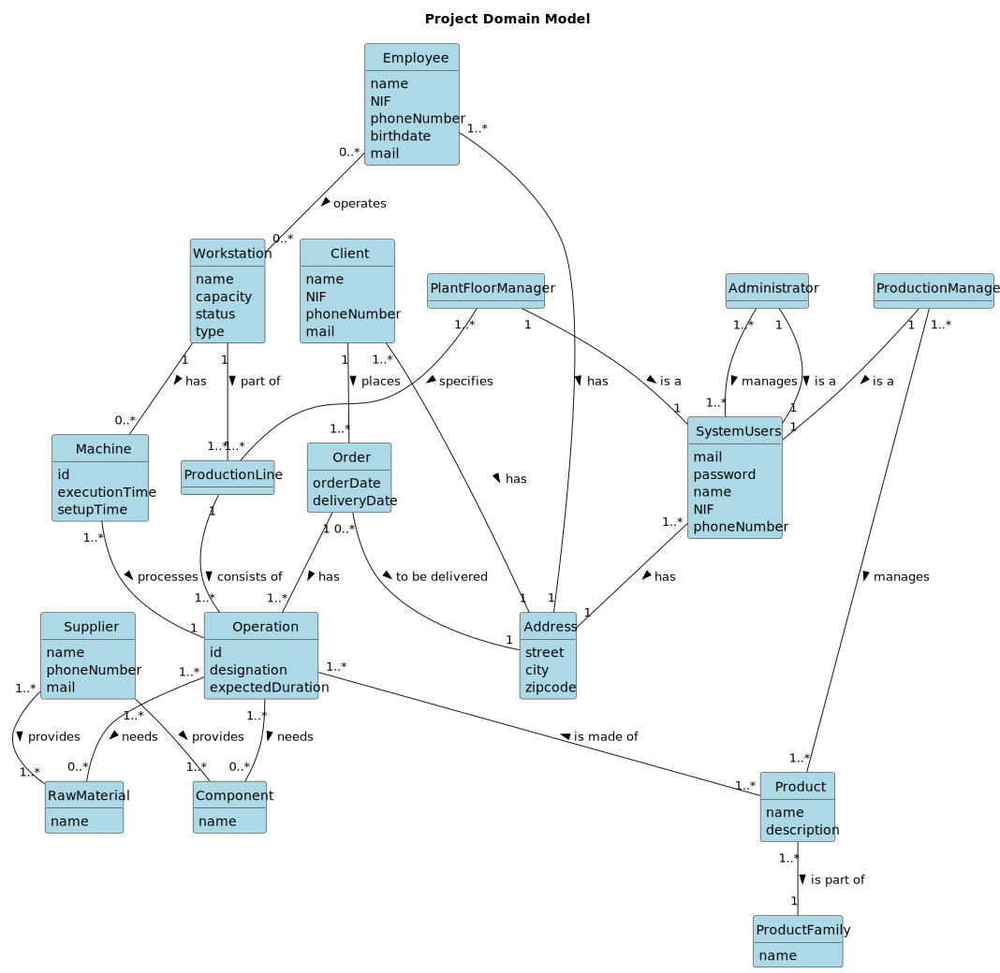

### INTEGRATIVE PROJECT 3RD SEMESTER ISEP-LEI

# BUILDFLOW

The FOURCORP group is introducing BUILDFLOW, a program for managing production lines.

## BUILDFLOW PROJECT STRUCTURE

The main Java program you'll find when you open the project is the (**prodPlanSimulator**) Production Planner Simulator.

Inside the folder [others](/others) you can find: 
- **documentation**
- **plantFloorManager** - application to manage Plant Floor - PL/SQL scripts for Oracle
- **machineSupervisor** - application to supervise and operate machines on Plant Floor - C and Assembly
- **projectManager** - Manager for Projects using PERT/CPM methodology - JAVA application

## PROJECT DOMAIN MODEL

