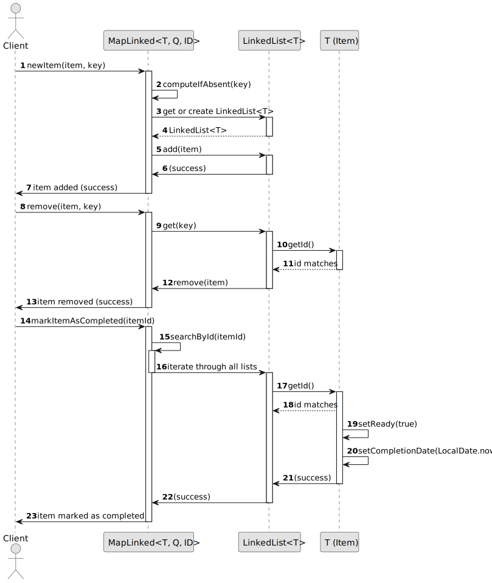

# USEI01 - Define the adequate data structures to store the information imported from the files

## Design - User Story Realization

### A) Rationale

| Question: Which class is responsible for... | Answer            | Justification                                                                                                                              |
|:--------------------------------------------|:------------------|:-------------------------------------------------------------------------------------------------------------------------------------------|
| 	... storing all the data?                  | **MapLinked**     | This class represents the service responsible for managing elements grouped by keys, which includes adding, searching, and removing items. |
| ... creating the item data structure?       | **Identifiable**  | This interface defines the necessary structure for items in the system, including a method to retrieve their ID.                           |
| ... managing the key-value structure?       | **Map**           | The Map data structure is used to store and group items by their associated keys. Each key is mapped to a list of items.                   |
| ... storing items by keys?                  | **LinkedList<T>** | A linked list is used for efficient insertion and removal of items based on their associated keys.                                         |

### Systematization

According to the rationale taken, the conceptual classes promoted to software classes are:

* **Identifiable**: Represents an interface for items in the system. It contains the method `getId()` to retrieve the
  unique identifier of each item.
* **MapLinked**: Manages a collection of items grouped by keys, using a `Map<Q, LinkedList<T>>` to store items
  associated with each key.

Other software classes (i.e. Pure Fabrication) identified:

* **Map**: A pure fabrication to store items based on their associated keys.
* **LinkedList<T>**: A pure fabrication used to store and manage multiple items efficiently by allowing operations like
  adding and removing items.

## B) Sequence Diagram (SD)

This diagram shows the full sequence of interactions between the classes involved in the realization of this user story.

## C) Class Diagram (CD)

