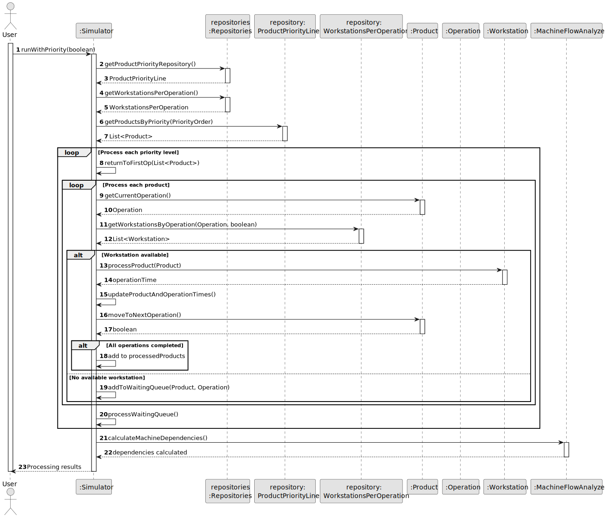
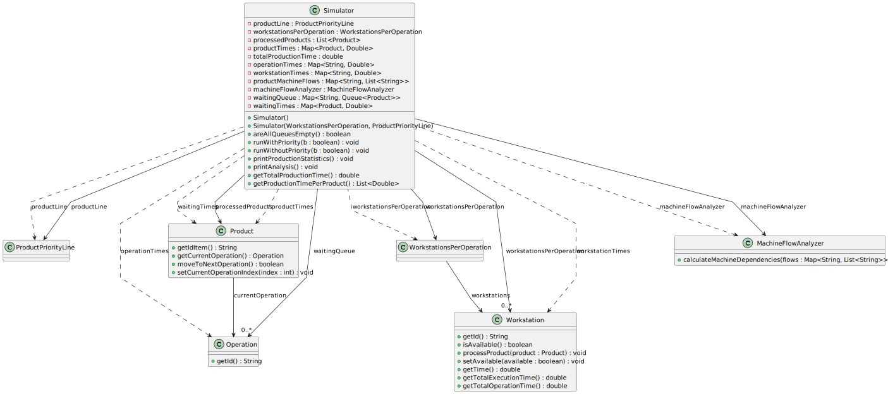

# USXX## - Something

## Design - User Story Realization 

### A) Rationale

| Question: Which class is responsible for...                               | Answer                                        | Justification                                                                                                                                                  |
|:--------------------------------------------------------------------------|:----------------------------------------------|:---------------------------------------------------------------------------------------------------------------------------------------------------------------|
| ... coordinating the execution of operations in the system?               | Simulator                                     | The Simulator is responsible for managing the simulation process and coordinating interactions between various components.                                     |
| ... accessing and managing data related to products and workstations?     | WorkstationsPerOperation, ProductPriorityLine | These classes handle retrieving and managing data related to products and their associated priorities, as well as workstations linked to different operations. |
| ... tracking and updating the state of individual products in the system? | Product                                       | The Product class holds state information such as the current operation and tracks its progress through the workflow.                                          |
| ... calculating dependencies and analyzing machine flows?                 | MachineFlowAnalyzer                           | This class is introduced to encapsulate the logic for calculating dependencies and analyzing the flow of machines.                                             |
| ... storing statistics and production metrics for the simulation?         | Simulator                                     | The Simulator class keeps track of various metrics such as total production time, operation times, and waiting times.                                          |
| ... implementing business rules for processing products at workstations?  | Workstation                                   | The Workstation class encapsulates the business rules for processing products, checking availability, and updating execution times.                            |
| ... managing queues of products waiting for operations?                   | Simulator                                     | The Simulator manages the waiting queues for products during the simulation process.                                                                           |

### Systematization ##

According to the rationale, the conceptual classes promoted to software classes are:

* Product: Represents an item moving through the production process.
* Operation: Encapsulates the details and identity of a specific operation in the workflow.
* Workstation: Represents a station where operations are executed on products.

Other software classes (i.e. Pure Fabrication) identified: 

* Simulator: Coordinates the overall simulation, processes, and data flow.
* MachineFlowAnalyzer: Handles the logic for analyzing and calculating machine dependencies and flow.
* ProductPriorityLine: Manages product priority queues and sorting.
* WorkstationsPerOperation: Manages the allocation and retrieval of workstations for different operations.

## B) Sequence Diagram (SD)

This diagram shows the full sequence of interactions between the classes involved in the realization of this user story.

## C) Class Diagram (CD)

