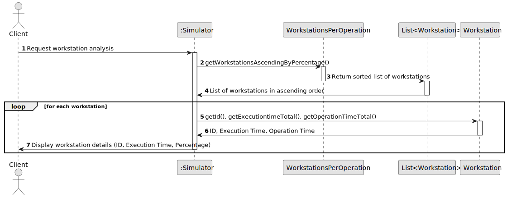
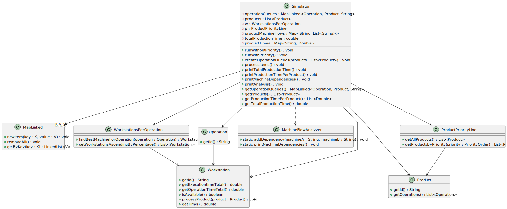

# USEI05 - Present a list of machines with total time of operation, and percentages relative to the operation time and total execution time

## Design - User Story Realization 

### A) Rationale

| Question: Which class is responsible for... | Answer        | Justification                                                                                                 |
|:--------------------------------------------|:--------------|:--------------------------------------------------------------------------------------------------------------|
| 	... interacting with the actor?            | CreateSkillUI | Pure Fabrication: there is no reason to assign this responsibility to any existing class in the Domain Model. |

### Systematization ##

According to the taken rationale, the conceptual classes promoted to software classes are: 

* ZZZZZZZZZZZZZZZZ

Other software classes (i.e. Pure Fabrication) identified: 

* ZZZ
* UUU
* WWW

## B) Sequence Diagram (SD)

This diagram shows the full sequence of interactions between the classes involved in the realization of this user story.

## C) Class Diagram (CD)

