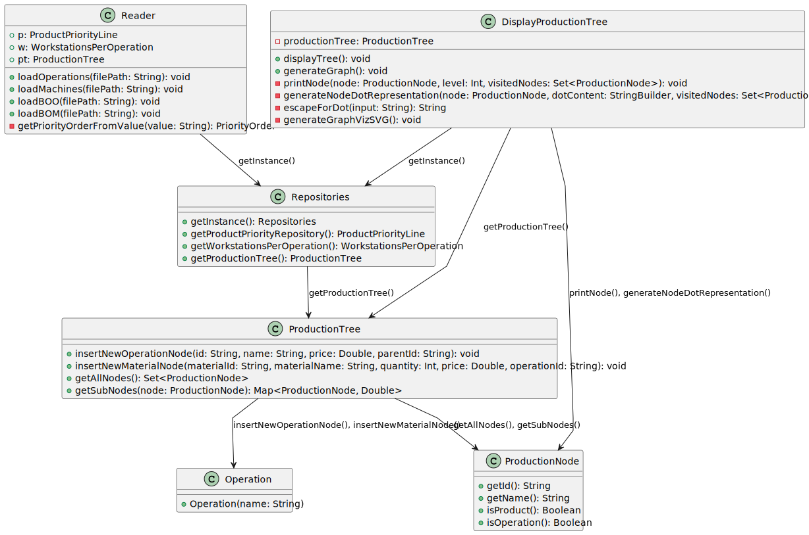

# USEI09 - Build the complete production tree of a product

## Design - User Story Realization 

### A) Rationale
| Question: Which class is responsible for...                  | Answer                | Justification                                                                                                                           |
|:-------------------------------------------------------------|:----------------------|:----------------------------------------------------------------------------------------------------------------------------------------|
| 	... loading the operations data from a CSV?                 | Reader                | The `Reader` class is responsible for loading operations data from a CSV file and passing it to the `ProductionTree`.                   |
| 	... inserting new operation nodes into the production tree? | ProductionTree        | The `ProductionTree` class handles the insertion of new operation nodes, creating new `ProductionNode` objects.                         |
| 	... inserting new material nodes into the production tree?  | ProductionTree        | The `ProductionTree` class is responsible for inserting new material nodes and associating them with the corresponding operation nodes. |
| 	... displaying the production tree to the user?             | DisplayProductionTree | The `DisplayProductionTree` class is responsible for displaying the structure of the production tree to the user.                       |
| 	... updating material quantities in the tree?               | ProductionTree        | The `ProductionTree` class manages the updating of material quantities and propagates changes throughout the tree.                      |
| 	... searching for nodes by name or ID?                      | ProductionTree        | The `ProductionTree` class handles searching for nodes by name or ID, retrieving relevant details about the node.                       |

### Systematization ##

According to the taken rationale, the conceptual classes promoted to software classes are:

* `Reader` – Responsible for loading data from files (operations and BOM) into the system.
* `ProductionTree` – Manages the structure of the production tree, handling the insertion of new nodes, material updates, and node searches.

Other software classes (i.e. Pure Fabrication) identified:

* `DisplayProductionTree` – Not part of the domain model but created to handle the display of the production tree to the user.
* `ProductionNode` – Representing individual nodes in the production tree; though it's a domain object, it's created and managed by `ProductionTree`.

## B) Sequence Diagram (SD)

This diagram shows the full sequence of interactions between the classes involved in the realization of this user story.

## C) Class Diagram (CD)

