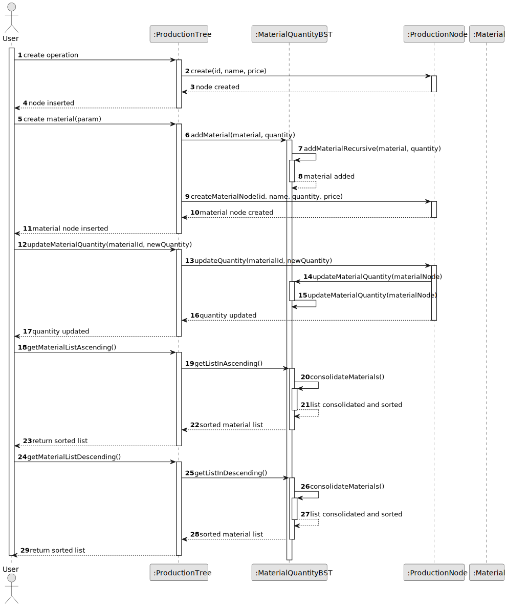
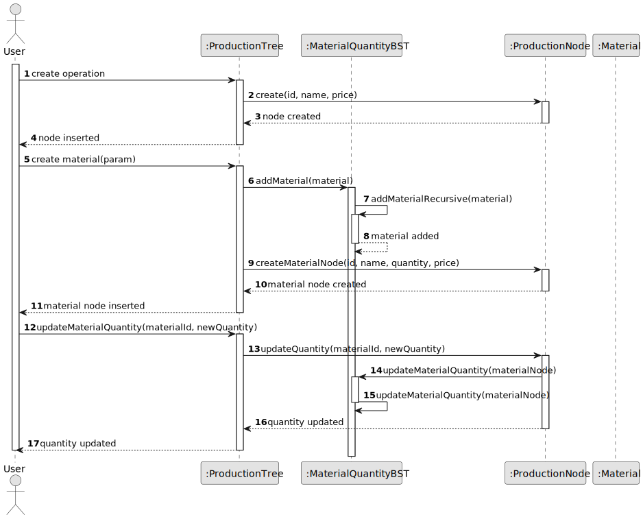

# USEI11 - Tracking material quantities (Binary Search Tree)

## Design - User Story Realization 

### A) Rationale

| Question: Which class is responsible for...                        | Answer                               | Justification                                                                                                                                                                |
|:-------------------------------------------------------------------|:-------------------------------------|:-----------------------------------------------------------------------------------------------------------------------------------------------------------------------------|
| ... creating an operation node in the production tree?             | ProductionTree                       | **ProductionTree** is responsible for managing the production tree and inserting new operation nodes. It directly handles the creation of **ProductionNode** for operations. |
| ... adding a material to the material quantity binary search tree? | MaterialQuantityBST                  | **MaterialQuantityBST** manages the addition of materials based on their quantity, ensuring that materials are stored in a sorted order within the tree structure.           |
| ... handling material data updates, like changing quantities?      | ProductionNode & MaterialQuantityBST | **ProductionNode** holds the material data and its updates, while **MaterialQuantityBST** ensures the BST structure is updated accordingly.                                  |
| ... creating a new material node in the production tree?           | ProductionTree                       | **ProductionTree** creates new material nodes by associating them with their parent operation node and adding them to the production tree structure.                         |
| ... updating a material's quantity in the production tree?         | ProductionTree & MaterialQuantityBST | **ProductionTree** updates the material quantity in the node, while **MaterialQuantityBST** keeps the material data synchronized in the BST structure.                       |

### Systematization ##

According to the taken rationale, the conceptual classes promoted to software classes are:

* **ProductionTree**: This class is responsible for managing the production tree structure, inserting operation and material nodes, and handling updates to the tree.
* **MaterialQuantityBST**: This class manages the storage and retrieval of material data based on their quantity in a binary search tree. It also handles the addition, removal, and updates to the materials stored in the tree.
* **ProductionNode**: Represents individual nodes in the production tree, whether they are operations or materials, and contains their respective attributes (like ID, name, quantity, etc.).
* **Material**: Holds material data, such as ID, name, quantity, and price, and is used within the **ProductionNode** for material nodes.

Other software classes (i.e. Pure Fabrication) identified:

* **MaterialQuantityBST Node**: While **MaterialQuantityBST** is a conceptual class, the **Node** class within it is a Pure Fabrication that handles the tree structure.
* **UserInterface**: A supporting class for the user interaction layer, which doesn't map directly to a domain class.
* **Controller**: Facilitates communication between the user interface and the domain logic (such as the **ProductionTree** and **MaterialQuantityBST** classes), acting as an intermediary.

## B) Sequence Diagram (SD)

This diagram shows the full sequence of interactions between the classes involved in the realization of this user story.

## C) Class Diagram (CD)

