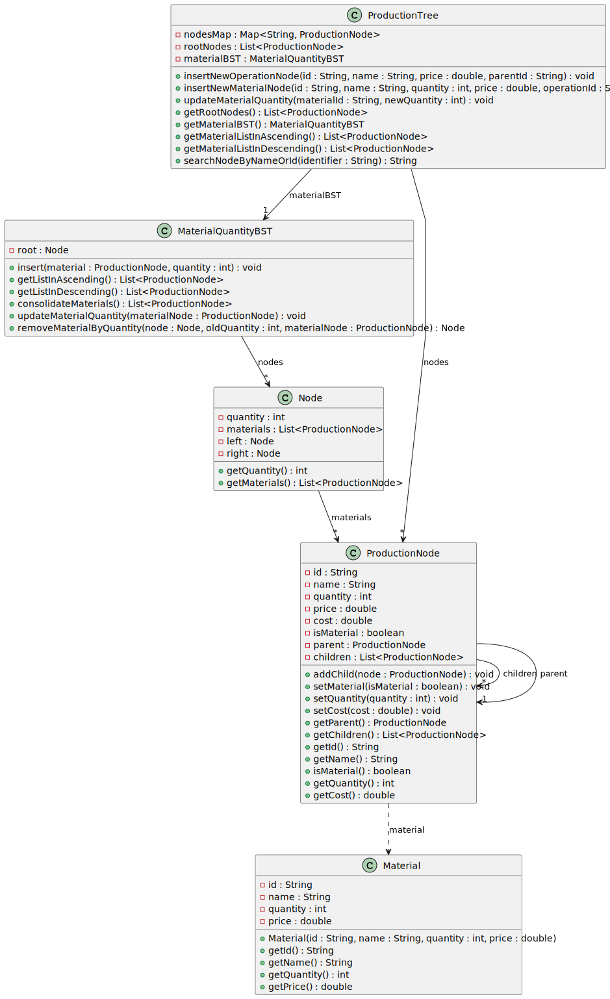

# USEI11 - Tracking material quantities (Binary Search Tree)

## Design - User Story Realization 

### A) Rationale
| Question: Which class is responsible for...                          | Answer                               | Justification                                                                                                                                                                |
|:---------------------------------------------------------------------|:-------------------------------------|:-----------------------------------------------------------------------------------------------------------------------------------------------------------------------------|
| ... creating an operation node in the production tree?               | ProductionTree                       | **ProductionTree** is responsible for managing the production tree and inserting new operation nodes. It directly handles the creation of **ProductionNode** for operations. |
| ... adding a material to the material quantity binary search tree?   | MaterialQuantityBST                  | **MaterialQuantityBST** manages the addition of materials based on their quantity, ensuring that materials are stored in a sorted order within the tree structure.           |
| ... handling material data updates, like changing quantities?        | ProductionTree & MaterialQuantityBST | **ProductionTree** updates the node's material data, and **MaterialQuantityBST** ensures the BST structure is synchronized with the updated material quantity.               |
| ... creating a new material node in the production tree?             | ProductionTree                       | **ProductionTree** creates new material nodes by associating them with their parent operation node and adding them to the production tree structure.                         |
| ... updating a material's quantity in the production tree?           | ProductionTree & MaterialQuantityBST | **ProductionTree** updates the material quantity in the node, while **MaterialQuantityBST** keeps the material data synchronized in the BST structure.                       |
| ... retrieving a list of materials in ascending or descending order? | MaterialQuantityBST                  | **MaterialQuantityBST** consolidates material data and provides ordered lists of materials based on their quantities, either ascending or descending.                        |
| ... consolidating materials with the same ID and name?               | MaterialQuantityBST                  | **MaterialQuantityBST** consolidates materials by combining quantities of materials with the same ID and name across all nodes.                                              |

### Systematization ##

According to the taken rationale, the conceptual classes promoted to software classes are:

* **ProductionTree**: This class is responsible for managing the production tree structure, inserting operation and material nodes, and handling updates to the tree.
* **MaterialQuantityBST**: This class manages the storage and retrieval of material data based on their quantity in a binary search tree. It also handles the addition, removal, and updates to the materials stored in the tree.
* **ProductionNode**: Represents individual nodes in the production tree, whether they are operations or materials, and contains their respective attributes (like ID, name, quantity, etc.).

Other software classes (i.e. Pure Fabrication) identified:

* **None**

## B) Sequence Diagram (SD)

This diagram shows the full sequence of interactions between the classes involved in the realization of this user story.

## C) Class Diagram (CD)

